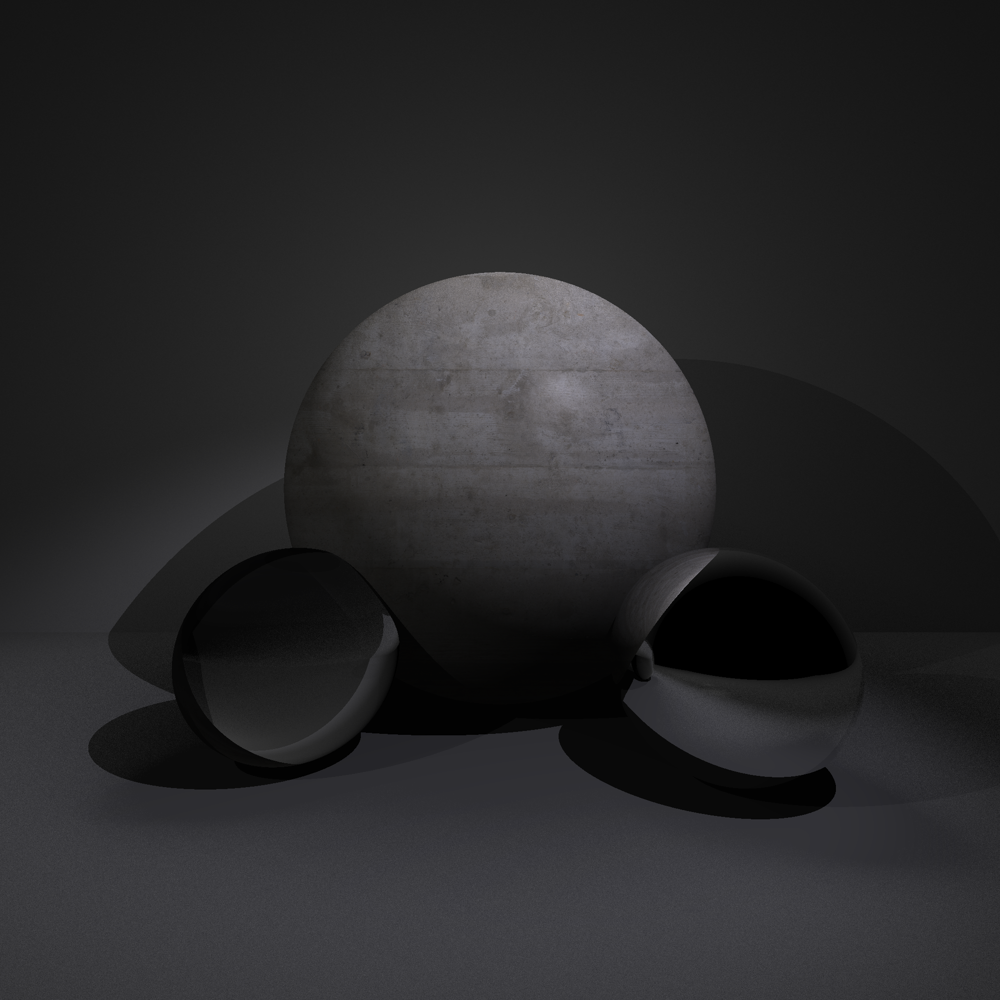
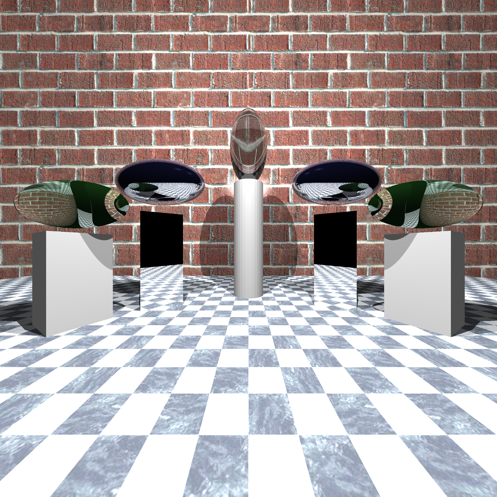

# Whitted Raytracer (C++)

This project is a **CPU-based ray tracer** written in C++, developed as part of a *Computer Graphics* course.  
It is implemented **without any external rendering frameworks** and focuses on classic ray tracing techniques.

The only external libraries used are:
- a lightweight **PNG reader/writer**
- a simple **XML parser** for scene descriptions

The project is built using **CMake** and compiled with **g++ (version 7.5)**.

---

## Build Instructions

### Requirements
- **g++ 7.5**
- **CMake ≥ 3.10**
- Linux / WSL / Unix-like environment

### Build Steps
```bash
cd build

cmake ..

cmake --build . -j
```

---

## Run

Run the ray tracer with a scene XML file:
```bash
./raytracer <path-to-scene.xml>
```

All required OBJ meshes and texture files are included in the repository.

Textures and bump maps must be located in:
`assets/textures/`

---

## Rendered Results

### Example 8 – Advanced Lighting and Materials
- Output image: `build/example8.png`



### Example 7 – Complex Geometry
- Output image: `build/example7.png`



---

## Implemented Features
- Phong illumination model
- Anti-aliasing
- Texture mapping
- Bump mapping
- Reflection
- Refraction
- Area lights with soft shadows
- Spot lights
- Bounding Volume Hierarchy (BVH) acceleration

---

## BVH Acceleration

The ray tracer supports an optional **Bounding Volume Hierarchy (BVH)** to accelerate ray–scene intersection tests.

BVH can be enabled or disabled using the `useBvh` flag in `scene.h`.

Measured performance:
- Example 7: ~8× speedup with BVH enabled  
- Example 8: small speedup, since area light sampling and soft shadows dominate the rendering cost

